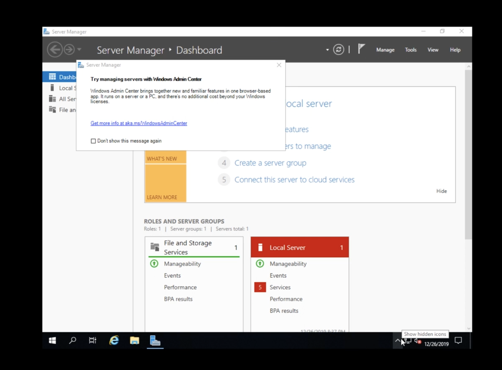
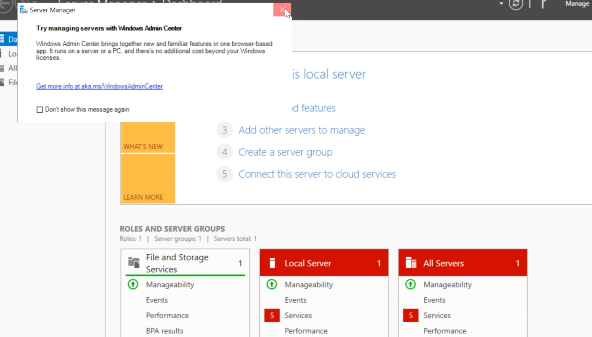
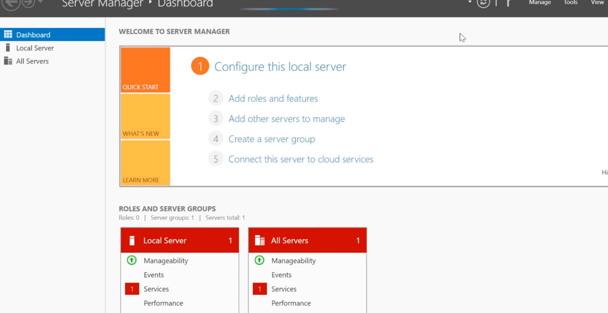

# Active Directory User Management Lab

## Project Overview

This project demonstrates the deployment and administration of a Microsoft Active Directory environment using Windows Server.

The lab focuses on domain administration, user management, group management, shared resources, and core identity and access management (IAM) concepts commonly used in enterprise environments.

---

## Technologies Used

- Windows Server
- Active Directory Domain Services (AD DS)
- DNS
- Group Management
- User Administration
- SMB File Shares
- Identity and Access Management (IAM)

---

## Lab Environment

| Component | Description |
|------------|------------|
| Platform | Windows Server |
| Directory Service | Active Directory Domain Services |
| Domain | MARVEL.local |
| Services | AD DS, DNS |
| File Sharing | SMB |
| Management Tool | Active Directory Users and Computers |

---

## Project Objectives

- Install and configure Active Directory Domain Services
- Create and manage users
- Create and manage groups
- Configure shared resources
- Understand enterprise identity management
- Practice access control administration

---

# Phase 1: Domain Controller Configuration

A Windows Server environment was configured as a Domain Controller.

### Domain Controller Dashboard

The server was configured to provide:

- Active Directory Domain Services
- DNS Services
- Domain Authentication
- Centralized User Management

---

# Phase 2: Active Directory Configuration

The Active Directory environment was successfully deployed and verified.

### Active Directory Users and Computers

The domain structure included:

- Users
- Groups
- Computers
- Domain Controllers
- Built-in Administrative Accounts

---

# Phase 3: Shared Resource Management

Shared resources were configured and managed through Windows Server.

### Network Shares

Configured shares included:

- NETLOGON
- SYSVOL

These shares are critical components of Active Directory environments and support authentication and Group Policy operations.

---

# Identity and Access Management Concepts

This project demonstrates several IAM concepts used in enterprise environments:

- User Provisioning
- Authentication
- Authorization
- Group-Based Access Control
- Centralized Identity Management
- Domain Administration

---

# Administrative Tasks Performed

### User Management

- Created user accounts
- Managed user properties
- Reset passwords
- Controlled account access

### Group Management

- Created security groups
- Assigned users to groups
- Applied role-based access control concepts

### Domain Administration

- Managed domain resources
- Configured Active Directory services
- Verified domain functionality

---

# Skills Demonstrated

- Active Directory Administration
- Windows Server Administration
- Identity and Access Management (IAM)
- User Account Management
- Group Management
- Access Control
- DNS Fundamentals
- File Share Administration
- Enterprise Authentication Concepts

---

# Results

The project successfully demonstrated:

✅ Active Directory deployment

✅ User account administration

✅ Group management

✅ Domain management

✅ Identity and access management concepts

✅ Windows Server administration

✅ Shared resource configuration

---

# Key Takeaways

This project provided hands-on experience with Active Directory administration and enterprise identity management.

Through this lab, I gained practical experience managing users, groups, domain resources, and authentication services in a Windows Server environment.

The skills developed in this project are directly applicable to:

- IAM Analyst Roles
- SOC Analyst Roles
- IT Support Positions
- System Administration Roles
- Cybersecurity Analyst Positions

---

## Screenshots

### 1. Domain Controller Dashboard

### 2. Active Directory Users and Computers

### 3. Network Shares

---

## Author

**Gisele Ribeiro**

Cybersecurity Student | Identity & Access Management | Active Directory | Windows Server

**Project Date:** June 2026
