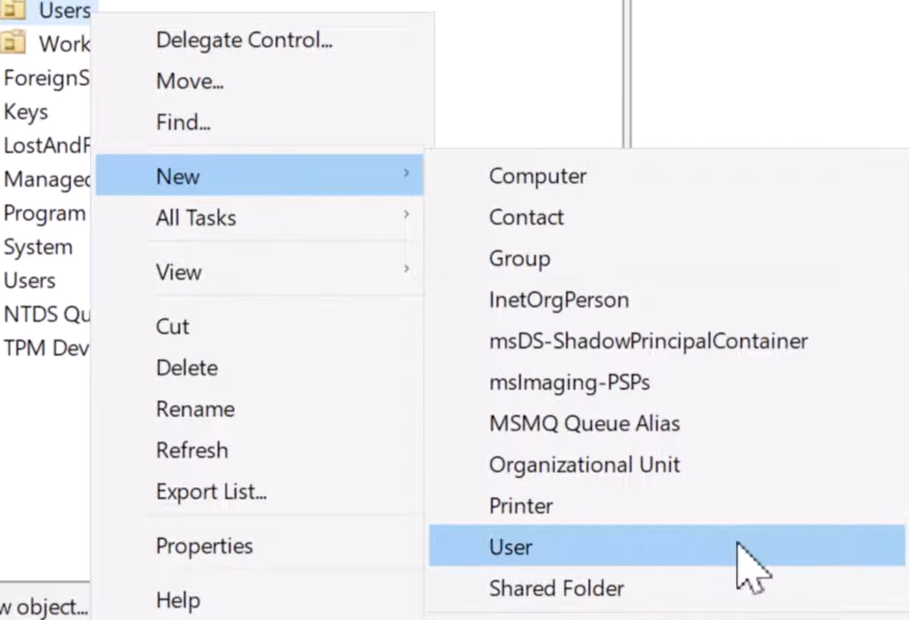
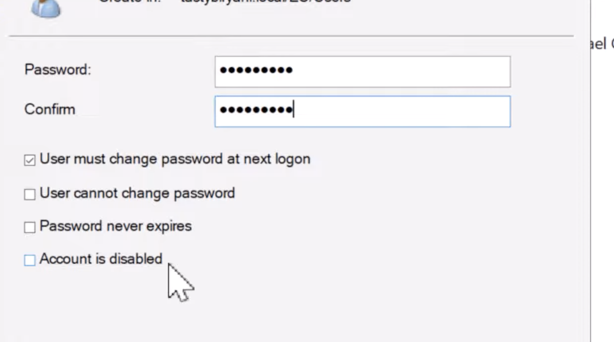
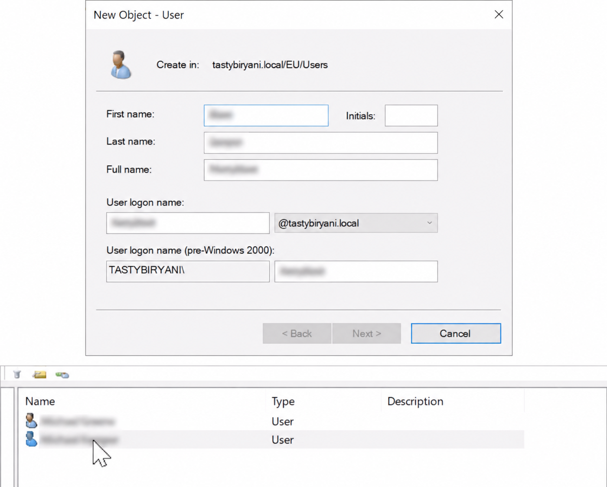

# Active Directory / Windows User Management Lab

## Project Overview

This project demonstrates basic user and access management concepts using a Windows/Active Directory-style environment.

The goal of this lab is to practice how IT and cybersecurity teams manage user accounts, groups, permissions, password resets, account disabling, and least privilege access.

This project connects to Identity and Access Management (IAM), IT support, GRC, and cybersecurity analyst responsibilities.

---

## Skills Practiced

- Active Directory concepts
- Windows user management
- User onboarding
- User offboarding
- Password reset process
- Group-based access control
- Least privilege
- Access review documentation
- Security documentation
- Troubleshooting user access issues

---

## Scenario

A small company has employees in different departments, including HR, Finance, IT, Sales, and temporary contractors.

Each employee should only have access to the systems and folders needed for their job role. The company wants to reduce security risks by using groups, limited permissions, and access reviews.

---

## Example User Accounts

| User | Department | Role | Access Needed |
|---|---|---|---|
| Maria Santos | HR | HR Assistant | HR shared folder |
| James Miller | Finance | Finance Analyst | Finance shared folder |
| Ana Costa | Sales | Sales Representative | Sales shared folder |
| Robert Lee | IT | IT Support | IT tools and support folders |
| Kevin Brown | Contractor | Temporary Worker | Temporary project folder only |

---

## Example Security Groups

| Group Name | Purpose | Access Level |
|---|---|---|
| HR-ReadOnly | HR employees who only need to view HR files | Read-only |
| Finance-ReadOnly | Finance employees who only need to view finance files | Read-only |
| Sales-Team | Sales employees who need sales documents | Standard access |
| IT-Support | IT team members who support users and systems | Elevated access |
| Contractors-Temp | Temporary workers with limited access | Limited access |

---

## Access Control Rules

1. Users should only receive access required for their job.
2. Permissions should be assigned through groups instead of individual users.
3. Contractor access should be temporary.
4. Admin access should be limited to authorized IT staff.
5. Former employees should be disabled immediately.
6. Access should be reviewed regularly.
7. Password resets should follow identity verification procedures.

---

## User Onboarding Process

When a new employee joins the company:

1. Confirm the employee’s full name, department, role, and manager.
2. Create the user account.
3. Assign the user to the correct security group.
4. Avoid giving unnecessary access.
5. Set a temporary password.
6. Require the user to change the password at first login.
7. Document who approved the access.
8. Confirm the user can log in and access only the correct folders.

---

## User Offboarding Process

When an employee leaves the company:

1. Disable the user account.
2. Remove the user from all security groups.
3. Revoke access to shared folders and systems.
4. Remove remote access or VPN access if applicable.
5. Document the date and time the account was disabled.
6. Confirm with the manager that access is no longer needed.

---

## Password Reset Process

When a user requests a password reset:

1. Verify the user’s identity.
2. Confirm the request is legitimate.
3. Reset the password using a temporary password.
4. Require the user to change the password at next login.
5. Remind the user not to share passwords.
6. Document the password reset request.

---

## Account Lockout Troubleshooting

If a user is locked out:

1. Confirm the user’s identity.
2. Check if the account is locked.
3. Ask if the user recently changed their password.
4. Check if the old password is saved on another device.
5. Unlock the account if appropriate.
6. Document the issue and resolution.

---

## Access Review Checklist

During an access review:

- Check if users still need their current access.
- Review users with admin or elevated permissions.
- Check if contractors still need active accounts.
- Remove users from groups they no longer need.
- Confirm high-risk access with managers.
- Document all access changes.

---

## Example Findings

| Finding | Risk | Recommendation |
|---|---|---|
| Contractor account has no expiration date | User may keep access after the project ends | Set an expiration date |
| Finance user has access to HR folder | Privacy and data exposure risk | Remove HR access |
| Too many users are in IT-Support group | Higher risk of unauthorized changes | Limit elevated access |
| Former employee account is still active | Unauthorized access risk | Disable account immediately |
| Password reset was not documented | Weak audit trail | Document all password reset requests |

---

## Security Concepts Demonstrated

### Least Privilege

Users should only have the access needed to do their job. Giving extra access increases security risk.

### Role-Based Access Control

Access should be based on job role and department. Groups make access easier to manage and review.

### User Lifecycle Management

User access should be managed from onboarding to offboarding. Access should be removed when it is no longer needed.

### Access Reviews

Regular access reviews help reduce unnecessary permissions and support compliance.

---

<!-- 
TODO for me:
Add screenshots later:
1. User account creation
2. Security group creation
3. User added to group
4. Password reset setting
5. Account disabled
6. Folder permissions
-->

---

## What I Learned

This project helped me understand how Windows user management and Active Directory concepts support cybersecurity.

I learned that user accounts, groups, permissions, password resets, and account disabling are important parts of protecting company systems and data.

I also learned that documentation is important because IT and security teams need to track who has access, why they have access, and when access changes.

---

## How This Applies to a Cybersecurity Role

This project applies to IAM, IT support, GRC, and cybersecurity analyst roles.

In a real company, managing user access helps prevent unauthorized access, protect sensitive data, support compliance, and reduce security risk.

This lab also shows skills in troubleshooting, documentation, access control, and least privilege, which are important for entry-level cybersecurity and IT security roles.
