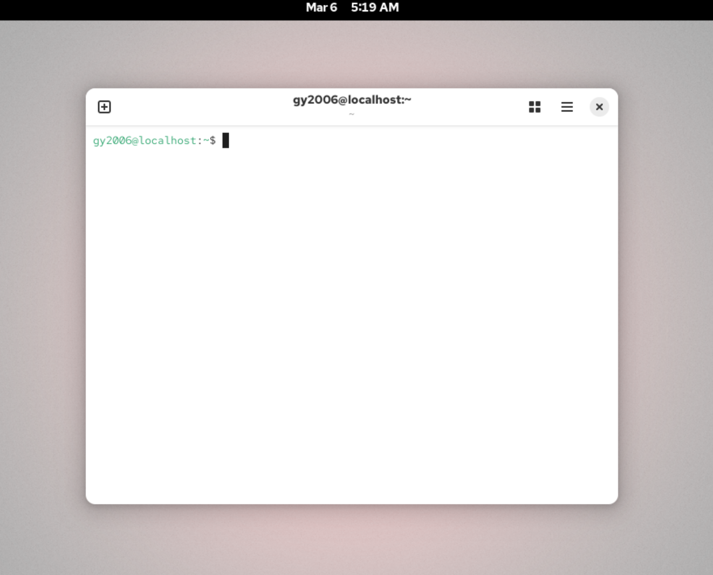
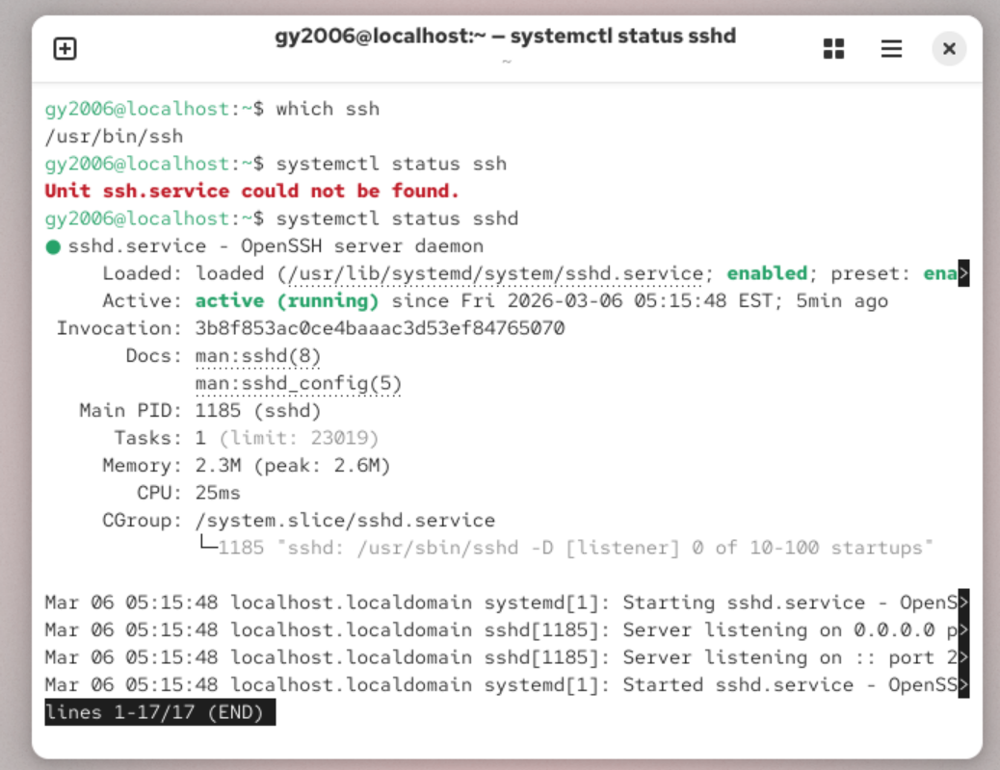
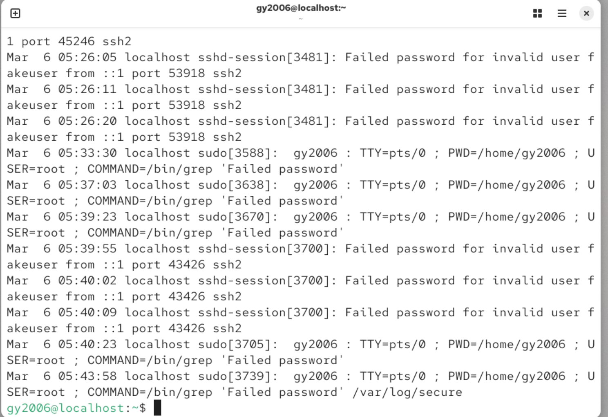
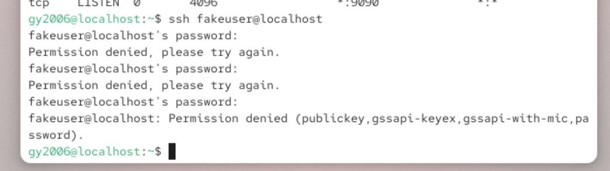

# 🔐 Linux Log Analysis – SSH Authentication Investigation

## 📌 Project Overview

This project demonstrates how Linux authentication logs can be analyzed to detect suspicious login activity.

A Linux virtual machine was used to simulate failed SSH login attempts. The authentication logs were then reviewed using command-line tools to identify potential brute-force activity.

This investigation replicates a basic Security Operations Center (SOC) task where analysts review system logs to detect unauthorized access attempts.

---

## 🖥 Lab Environment

| Component | Details |
|-----------|---------|
| Operating System | Red Hat Enterprise Linux (RHEL) |
| Virtualization Platform | VirtualBox |
| Log File Analyzed | /var/log/secure |
| Service Investigated | SSH (Secure Shell) |

---

## 🛠 Tools Used

- ssh
- systemctl
- ss
- grep
- wc
- Linux terminal

---

## Step 1 – Verify SSH Service Status

The SSH service was verified to ensure it was running on the system.

### Command Used

systemctl status sshd
 
### Explanation

This command checks whether the OpenSSH server daemon is active and able to accept incoming SSH connections.

### Expected Result

The output confirms that the SSH service is active (running).

---

## Step 2 – Verify SSH Listening Port

Next, the system was checked to confirm that SSH is listening for incoming connections.

### Command Used

ss -tulpn

### Expected Result

SSH is listening on:

TCP port 22

---

## Step 3 – Simulate Failed SSH Login Attempts

To simulate suspicious activity, several login attempts were made using an invalid username.

### Command Used

ssh fakeuser@localhost

### Result

Permission denied (publickey,password)

---

## Step 4 – Review Authentication Logs

Linux authentication logs were examined to identify failed login attempts.

### Command Used

sudo cat /var/log/secure

### Example Log Entry

Failed password for invalid user fakeuser from ::1 port 53918 ssh2

---

## Step 5 – Filter Failed Login Attempts

To isolate failed login attempts, the log file was filtered using grep.

### Command Used

sudo grep "Failed password" /var/log/secure

---

## Step 6 – Count Failed Login Attempts

To quantify suspicious activity, the number of failed login attempts was counted.

### Command Used

sudo grep "Failed password" /var/log/secure | wc -l

### Result

25 failed login attempts detected

---

## 🔎 Findings

Multiple failed login attempts targeted the SSH service.

Observations:

- Invalid username used
- Attempts originated from localhost
- Activity simulated in the lab environment

---

## 🛡 Security Recommendations

- Disable password authentication and use SSH key-based authentication
- Install fail2ban to block repeated failed login attempts
- Restrict SSH access using firewall rules
- Change the default SSH port
- Enable multi-factor authentication (MFA)

---

## 💻 Skills Demonstrated

- Linux administration
- Security log analysis
- Threat detection
- Command-line investigation
- Incident response methodology

---

## 📊 Conclusion

This project demonstrates how Linux authentication logs can be analyzed to detect suspicious login activity. Understanding how to investigate system logs is an essential skill for cybersecurity professionals working in Security Operations Centers (SOC).
