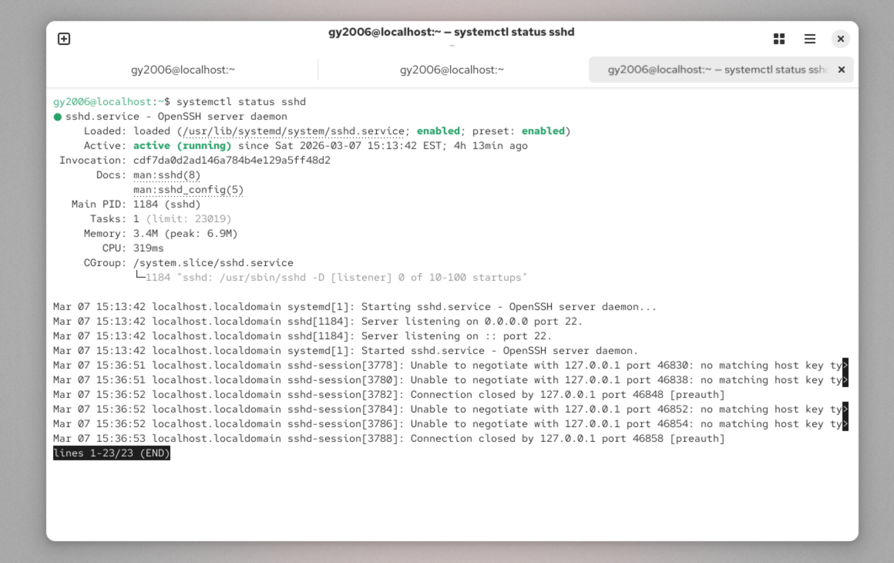
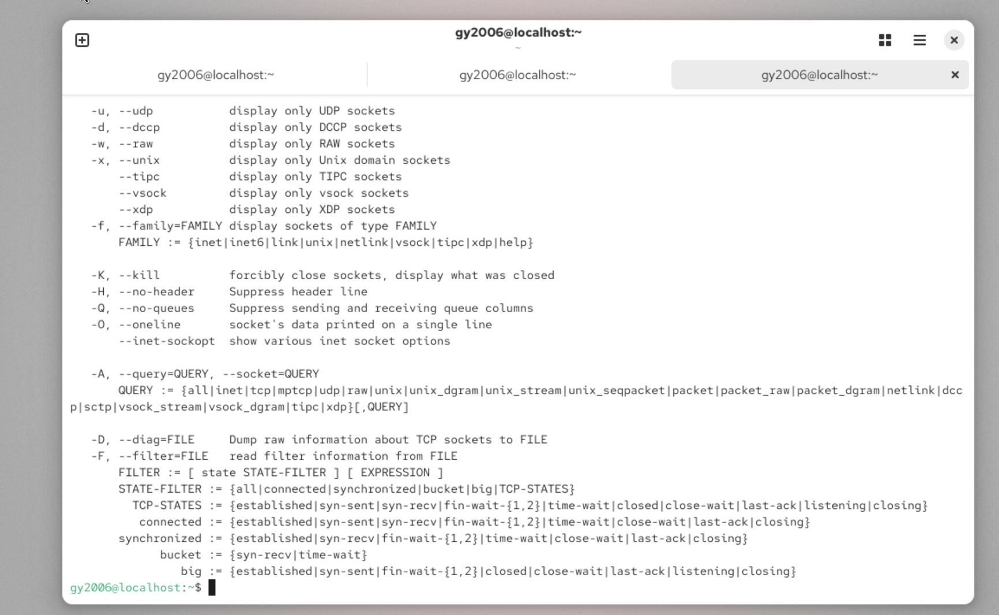
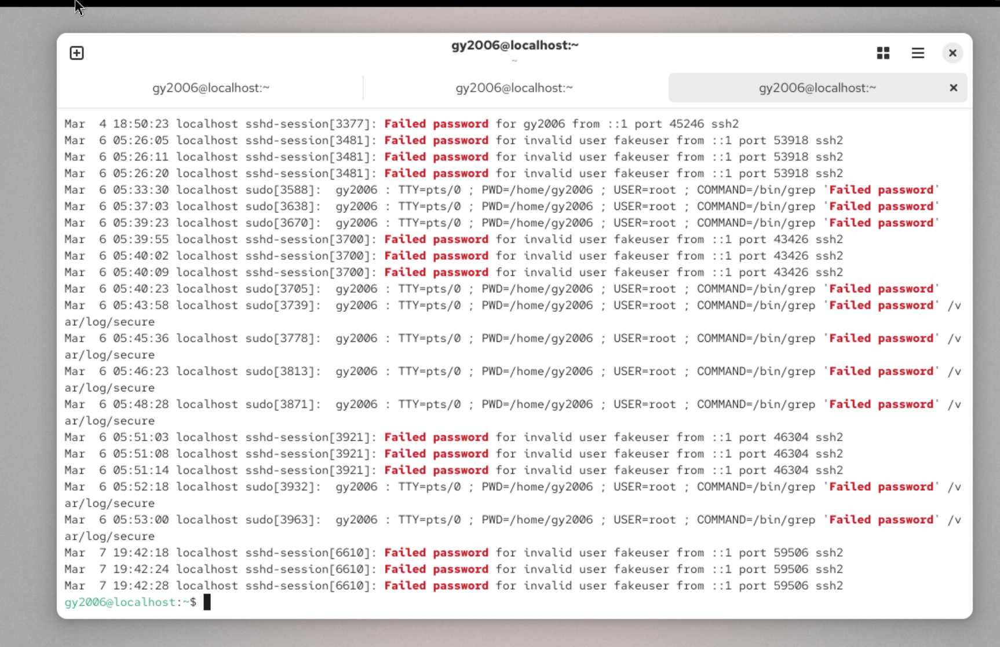
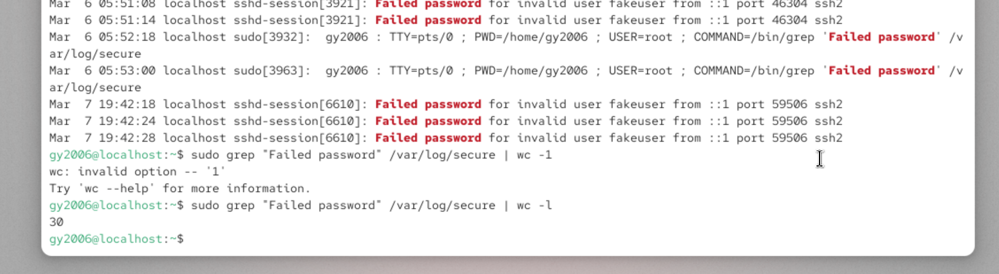

# 🔐 Linux Log Analysis – SSH Authentication Investigation

## 📌 Project Overview

This project simulates a real-world Security Operations Center (SOC) investigation involving suspicious SSH authentication activity on a Linux system.

Multiple failed login attempts were generated and analyzed using system logs to identify potential brute-force behavior. Log analysis techniques were applied to detect patterns, quantify failed attempts, and assess potential security risks.

This project demonstrates how security analysts investigate authentication logs to detect unauthorized access attempts and respond to potential threats.

---

## 🎯 SOC Relevance

This project reflects common tasks performed by Security Operations Center (SOC) analysts, including:

- Monitoring authentication logs for suspicious activity
- Identifying brute-force login attempts
- Investigating failed login patterns
- Using command-line tools to analyze security events

These skills are essential for detecting and responding to unauthorized access attempts in real-world environments.

---

## 🖥 Lab Environment

| Component | Details |
|-----------|---------|
| Operating System | Red Hat Enterprise Linux (RHEL) |
| Virtualization Platform | VirtualBox |
| Log File Analyzed | /var/log/secure |
| Service Investigated | SSH (Secure Shell) |

---

## 🛠 Tools Used

- ssh
- systemctl
- ss
- grep
- wc
- Linux terminal

---

## Step 1 – Verify SSH Service Status

The SSH service was verified to ensure it was running on the system.

### Command Used

systemctl status sshd

### Screenshot

### Explanation

This command checks whether the OpenSSH server daemon is active and able to accept incoming SSH connections.

### Expected Result

The output confirms that the SSH service is active (running).

---

## Step 2 – Verify SSH Listening Port

Next, the system was checked to confirm that SSH is listening for incoming connections.

### Command Used

ss -tulpn

### Screenshot

### Expected Result

SSH is listening on:

TCP port 22

---

## Step 3 – Simulate Failed SSH Login Attempts

To simulate suspicious activity, several login attempts were made using an invalid username.

### Command Used

ssh fakeuser@localhost

### Screenshot

### Result

Permission denied (publickey,password)

---

## Step 4 – Review Authentication Logs

Linux authentication logs were examined to identify failed login attempts.

### Command Used

sudo cat /var/log/secure

### Screenshot

### Example Log Entry

Failed password for invalid user fakeuser from ::1 port 53918 ssh2

---

## Step 5 – Filter Failed Login Attempts

To isolate failed login attempts, the log file was filtered using grep.

### Command Used

sudo grep "Failed password" /var/log/secure

---

## Step 6 – Count Failed Login Attempts

To quantify suspicious activity, the number of failed login attempts was counted.

### Command Used

sudo grep "Failed password" /var/log/secure | wc -l

### Result

30 failed login attempts detected

---

## 🔎 Findings

Analysis of the authentication logs revealed repeated failed SSH login attempts.

Key observations:
- Multiple failed login attempts detected (25 total)
- Attempts used an invalid username ("fakeuser")
- All attempts originated from localhost (::1)
- Activity pattern is consistent with brute-force behavior simulation

Although the activity was generated in a controlled lab environment, the patterns closely resemble real-world attack attempts targeting SSH services.

---

## 🛡 Security Recommendations

- Disable password authentication and use SSH key-based authentication
- Install fail2ban to block repeated failed login attempts
- Restrict SSH access using firewall rules
- Change the default SSH port
- Enable multi-factor authentication (MFA)

---
## 💻 Skills Demonstrated

- Linux system administration
- Security log analysis
- Detection of brute-force attacks
- Command-line investigation (grep, wc, ss)
- Threat identification and analysis
- Incident investigation workflow

---

## 📊 Conclusion

This project demonstrates how Linux authentication logs can be analyzed to detect suspicious login activity. Understanding how to investigate system logs is an essential skill for cybersecurity professionals working in Security Operations Centers (SOC).
