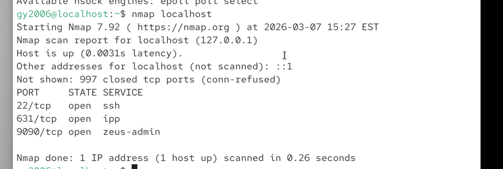
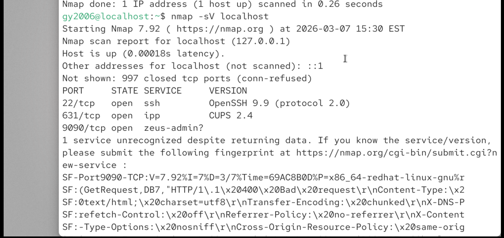
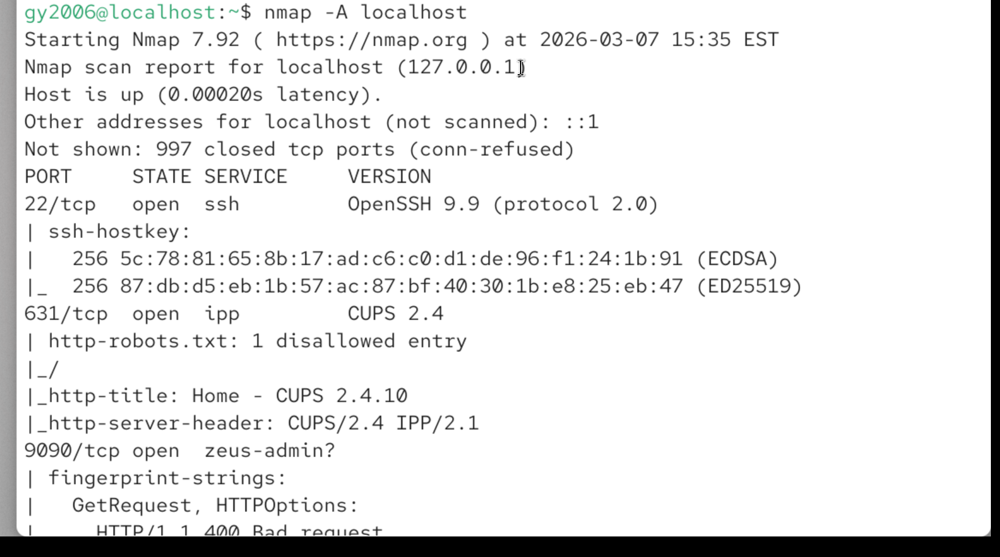

# 🌐 Network Analysis – Nmap Scan Investigation

## Project Overview

This project demonstrates how network scanning tools can be used to identify open ports and services on a system.

Using **Nmap (Network Mapper)**, a scan was performed against a local host to identify exposed services and potential security risks.

This type of investigation is commonly performed by **SOC analysts and penetration testers** to detect vulnerable services or unauthorized systems on a network.

---

## Tools Used

- Nmap
- Linux Terminal
- VirtualBox Lab Environment

---

## Step 1 – Perform a Basic Nmap Scan

The first step was to run a basic TCP scan against the target system.

### Command Used

nmap localhost

### Explanation

This command scans the most common TCP ports on the target host to identify open services.

### Example Result

Open ports detected:

| Port | Service |
|-----|------|
| 22 | SSH |
| 80 | HTTP |

These results indicate that the system is running an SSH service and a web server.

---

## Step 2 – Perform a Service Version Scan

To identify the exact versions of the services running on the system, the following command was executed.

### Command Used

nmap -sV localhost

### Explanation

The `-sV` flag enables **service version detection**, allowing analysts to determine what software versions are running on open ports.

This information is critical for identifying known vulnerabilities.

---

## Step 3 – Analyze Security Risks

After identifying open services, the results were reviewed to determine potential security concerns.

Example observations:

- SSH exposed on port **22**
- Web service running on **port 80**

If these services are exposed externally, they may become targets for:

- Brute-force attacks
- Exploitation of outdated software
- Unauthorized access attempts

---

## Key Takeaways

Network scanning is an essential step in identifying exposed services and potential attack surfaces.

Security analysts use tools like **Nmap** to:

- Detect open ports
- Identify running services
- Discover outdated software
- Evaluate network security posture

---

## Skills Demonstrated

- Network reconnaissance
- Port scanning
- Service detection
- Security analysis

## Basic Nmap Scan

---

## Service Version Detection

---

## Advanced Scan

