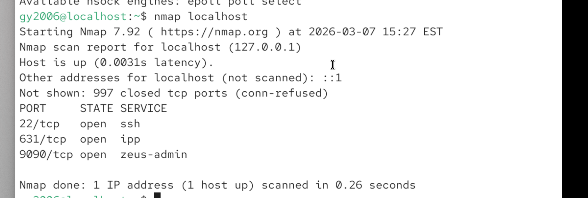
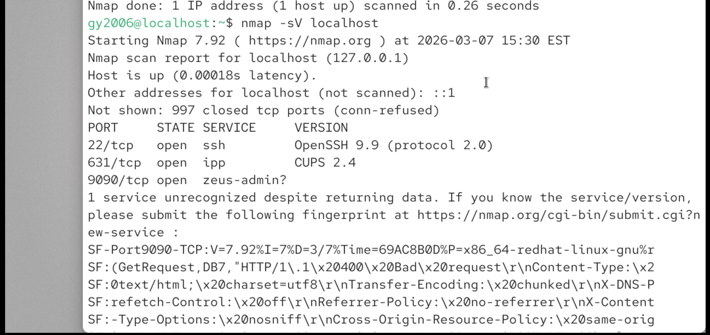
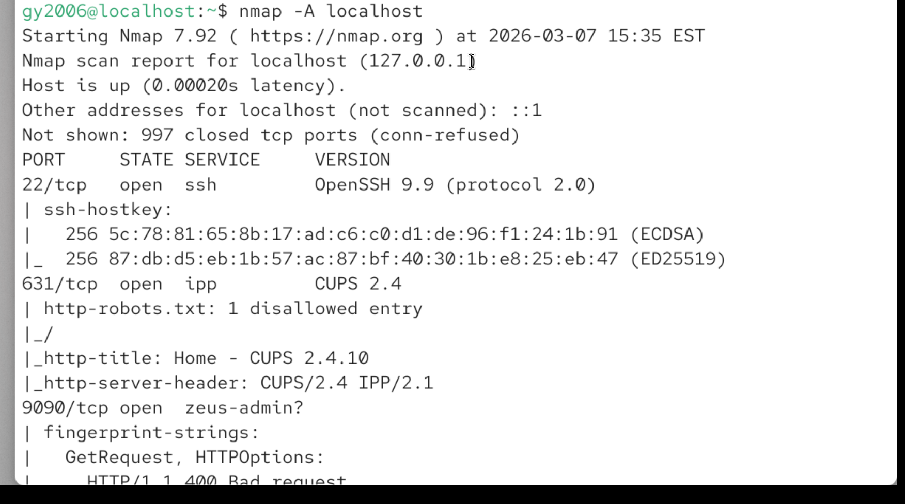

# 🌐 Network Scanning & Service Enumeration – Nmap Investigation

## 📌 Project Overview

This project demonstrates how network scanning techniques can be used to identify open ports, running services, and potential security risks on a target system.

Using Nmap (Network Mapper), multiple scans were performed against a local host to discover exposed services and gather detailed information about service versions.

This type of analysis is commonly performed by security analysts and penetration testers to identify attack surfaces and assess system exposure.

---

## 🎯 SOC Relevance

This project reflects real-world tasks performed by security analysts, including:

- Identifying exposed services on a host
- Detecting potential attack surfaces
- Performing service enumeration
- Assessing risk based on open ports

Network scanning is a critical first step in threat detection and vulnerability assessment.

---

## Tools Used

- Nmap
- Linux Terminal
- VirtualBox Lab Environment

---

## Step 1 – Perform a Basic Nmap Scan

The first step was to run a basic TCP scan against the target system.

### Command Used

nmap localhost

### Explanation

This command scans the most common TCP ports on the target host to identify open services.

### Example Result

Open ports detected:

| Port | Service |
|------|---------|
| 22 | SSH |
| 631 | IPP (CUPS) |
| 9090 | Unknown / zeus-admin |

These results indicate that the system is running an SSH service, a printing service (CUPS), and an additional unidentified service on port 9090.

---

## Step 2 – Perform a Service Version Scan

To identify the exact versions of the services running on the system, the following command was executed.
Service version detection allows analysts to correlate discovered services with known vulnerabilities (CVEs), making it a critical step in vulnerability assessment.

### Command Used

nmap -sV localhost

### Explanation

The `-sV` flag enables **service version detection**, allowing analysts to determine what software versions are running on open ports.

This information is critical for identifying known vulnerabilities.

---

## Step 3 – Analyze Security Exposure

After identifying open ports and services, the results were analyzed to assess potential security risks.

### Key Observations

- SSH service running on port 22 (potential brute-force target)
- IPP service (CUPS) running on port 631 (may expose printing services)
- Unknown service detected on port 9090 (requires further investigation)

### Security Considerations

- Exposed SSH services are commonly targeted by brute-force attacks
- Unnecessary services increase the system's attack surface
- Unknown or unrecognized services may indicate misconfiguration or hidden applications

If these services are exposed to external networks, they could be exploited by attackers.

---

## 🔎 Key Findings

Network scanning is an essential step in identifying exposed services and potential attack surfaces.

Security analysts use tools like **Nmap** to:

- Detect open ports
- Identify running services
- Discover outdated software
- Evaluate network security posture

These findings demonstrate how exposed services can increase the attack surface and highlight the importance of continuous network monitoring.

---

## 💻 Skills Demonstrated

- Network reconnaissance
- Port scanning and enumeration
- Service version detection
- Attack surface identification
- Security risk analysis

## Basic Nmap Scan

---

## Service Version Detection

---

## Advanced Scan

