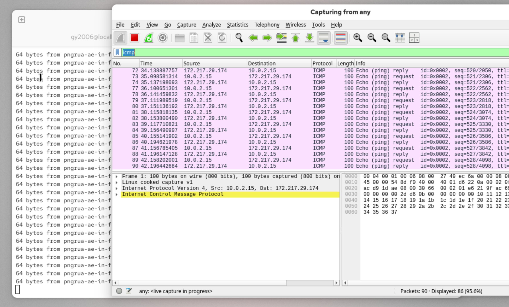

# Wireshark Traffic Analysis

## Project Overview

This project demonstrates how network traffic can be captured and analyzed using **Wireshark**, a widely used network protocol analyzer.

Different types of network traffic were generated and analyzed, including:

- ICMP (Ping)
- DNS queries
- HTTP web traffic

By capturing and inspecting packets, it is possible to observe how systems communicate across networks and how protocols operate in real-world environments.

---

# Tools Used

- Wireshark
- Linux (Red Hat Enterprise Linux)
- Terminal commands (ping, nslookup)
- Web browser

---

# Step 1 – Capture ICMP Traffic (Ping)

To generate ICMP traffic, the following command was executed in the terminal:

ping google.com

Wireshark was configured with the following display filter:

icmp

This allowed the capture of **ICMP Echo Requests and Echo Replies**, which are used by the ping utility to verify network connectivity.

## Screenshot

## Analysis

The packet capture shows ICMP packets exchanged between the local system and Google's server.

Important observations:

- Echo Request packets are sent from the local machine
- Echo Reply packets are returned by the remote server
- The successful exchange confirms that the network connection is functioning properly

ICMP traffic is commonly analyzed during **network troubleshooting and connectivity diagnostics**.

---

# Step 2 – Capture DNS Traffic

Next, a DNS query was generated using the following command:

nslookup google.com

Wireshark was filtered using:

dns

This displays DNS query and response packets.

## Screenshot

## Analysis

The capture shows DNS packets used to resolve the domain **google.com** into its IP address.

Key details observed:

- The local system sends a DNS query request to the DNS server
- The DNS server responds with the IP address associated with the domain

DNS traffic analysis is important in cybersecurity because suspicious domains may indicate:

- Malware activity
- Command-and-control communication
- Data exfiltration attempts

---

# Step 3 – Capture HTTP Traffic

To capture HTTP traffic, a web browser was used to visit:

http://example.com

Wireshark was filtered with:

http

## Screenshot

## Analysis

The capture shows HTTP requests and responses between the browser and the web server.

Key observations:

- The browser sends an **HTTP GET request**
- The server responds with **HTTP/1.1 200 OK**
- The communication occurs over **TCP port 80**

Because HTTP traffic is not encrypted, its contents can be inspected directly in packet captures.

This is why HTTPS encryption is widely used today.

---

# Key Takeaways

This project demonstrates how Wireshark can be used to:

- Capture live network traffic
- Analyze common protocols such as **ICMP, DNS, and HTTP**
- Observe how devices communicate over a network
- Investigate network behavior during troubleshooting or security analysis

---

# Skills Demonstrated

- Network packet analysis
- Wireshark filtering
- Protocol analysis
- Network troubleshooting

---

# Project Structure
