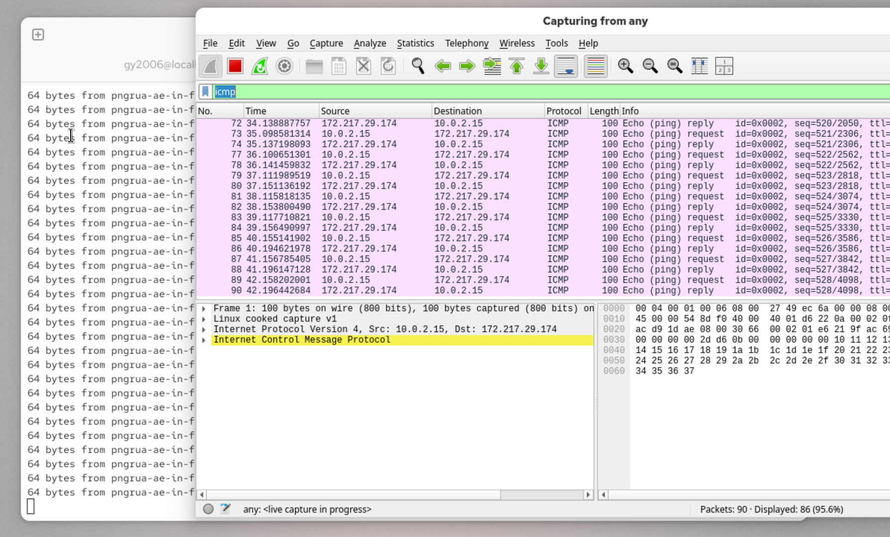
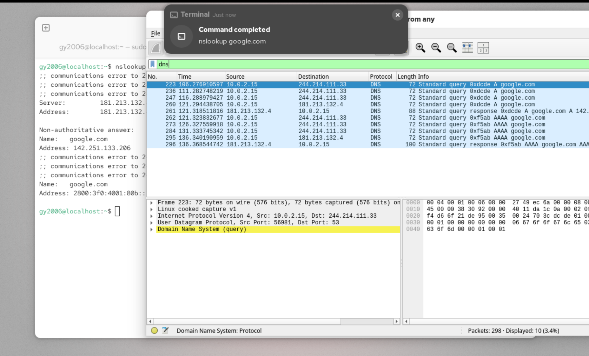
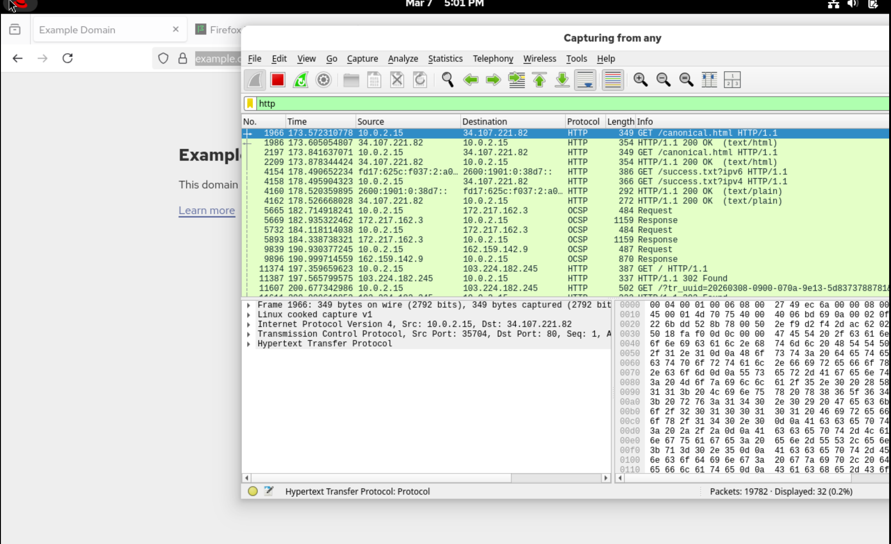

# 🌐 Network Traffic Analysis – Wireshark Investigation

📁 Project Type: Network Traffic Analysis / Packet Inspection

## Project Overview

This project demonstrates how network traffic can be captured and analyzed using **Wireshark**, a widely used network protocol analyzer.

Different types of network traffic were generated and analyzed, including:

- ICMP (Ping)
- DNS queries
- HTTP web traffic

By capturing and inspecting packets, analysts can observe how systems communicate across networks and identify normal and potentially suspicious behavior in real-world environments.

---

# Tools Used

- Wireshark
- Linux (Red Hat Enterprise Linux)
- Terminal commands (ping, nslookup)
- Web browser

---

## 🎯 SOC Relevance

This project reflects tasks performed by Security Operations Center (SOC) analysts, including:

- Monitoring network traffic for suspicious activity
- Identifying protocol behavior and anomalies
- Investigating DNS queries and web traffic
- Analyzing unencrypted traffic for potential threats

Packet analysis is essential for detecting malicious communication such as command-and-control traffic, data exfiltration, and unauthorized access.

---

## Step 1 – Capture ICMP Traffic (Ping)

To generate ICMP traffic, the following command was executed in the terminal:

ping google.com

Wireshark was configured with the following display filter:

icmp

This allowed the capture of **ICMP Echo Requests and Echo Replies**, which are used by the ping utility to verify network connectivity.

## Screenshot

## Analysis

The packet capture shows ICMP packets exchanged between the local system and Google's server.

Important observations:

- Echo Request packets are sent from the local machine
- Echo Reply packets are returned by the remote server
- The successful exchange confirms that the network connection is functioning properly

ICMP traffic is commonly analyzed during **network troubleshooting and connectivity diagnostics**.

---

# Step 2 – Capture DNS Traffic

Next, a DNS query was generated using the following command:

nslookup google.com

Wireshark was filtered using:

dns

This displays DNS query and response packets.

## Screenshot

## Analysis

The capture shows DNS packets used to resolve the domain **google.com** into its IP address.

Key details observed:

- The local system sends a DNS query request to the DNS server
- The DNS server responds with the IP address associated with the domain
- DNS traffic can also be used to detect suspicious domains associated with malware or phishing campaigns.

DNS traffic analysis is important in cybersecurity because suspicious domains may indicate:

- Malware activity
- Command-and-control communication
- Data exfiltration attempts

---

# Step 3 – Capture HTTP Traffic

To capture HTTP traffic, a web browser was used to visit:

http://example.com

Wireshark was filtered with:

http

## Screenshot

## Analysis

The capture shows HTTP requests and responses between the browser and the web server.

Key observations:

- The browser sends an **HTTP GET request**
- The server responds with **HTTP/1.1 200 OK**
- The communication occurs over **TCP port 80**

Because HTTP traffic is not encrypted, its contents can be inspected directly in packet captures, making it easier to analyze but also more vulnerable to interception.

This is why HTTPS encryption is widely used today.

---

## 🔎 Key Findings

This project demonstrates how Wireshark can be used to:

- Capture live network traffic
- Analyze common protocols such as **ICMP, DNS, and HTTP**
- Observe how devices communicate over a network
- Investigate network behavior during troubleshooting or security analysis
- These observations highlight how packet analysis can be used to detect abnormal network behavior and support security investigations.

---
## 💻 Skills Demonstrated

- Network packet analysis
- Protocol analysis (ICMP, DNS, HTTP)
- Wireshark filtering and inspection
- Traffic investigation
- Network troubleshooting
- Basic threat detection

---

# Project Structure
